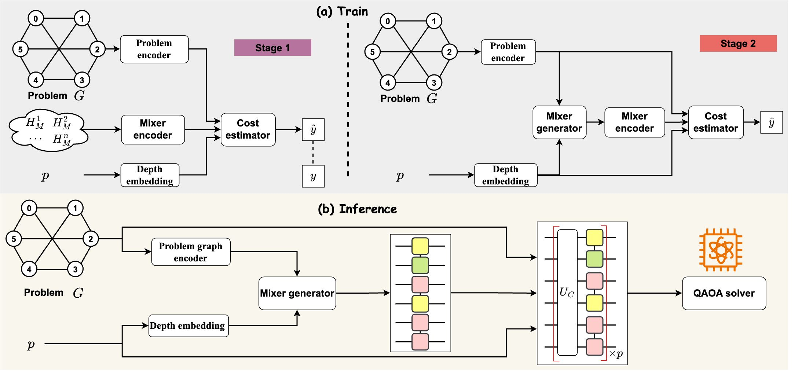

<div align="center">

# MG-Net: Learn to Customize QAOA with Circuit Depth Awareness (Neurips 2024)
</div>



> **MG-Net: Learn to Customize QAOA with Circuit Depth Awareness**
> - Authors: [Yang Qian](https://qqqyang.github.io/),
> Xinbiao Wang,
> [Yuxuan Du](https://yuxuan-du.github.io/), Yong Luo, Dacheng Tao
> - [arXiv](https://arxiv.org/abs/2409.18692)


## Abstract
Quantum Approximate Optimization Algorithm (QAOA) and its variants exhibit immense potential in tackling combinatorial optimization challenges. However, their practical realization confronts a dilemma: the requisite circuit depth for satisfactory performance is problem-specific and often exceeds the maximum capability of current quantum devices. To address this dilemma, here we first analyze the convergence behavior of QAOA, uncovering the origins of this dilemma and elucidating the intricate relationship between the employed mixer Hamiltonian, the specific problem at hand, and the permissible maximum circuit depth. Harnessing this understanding, we introduce the **Mixer Generator Network (MG-Net)**, a unified deep learning framework adept at dynamically formulating optimal mixer Hamiltonians tailored to distinct tasks and circuit depths. Systematic simulations, encompassing Ising models and weighted Max-Cut instances with up to 64 qubits, substantiate our theoretical findings, highlighting MG-Net's superior performance in terms of both approximation ratio and efficiency.

## Bibtex

If this work is helpful for your research, please consider citing the following entry.

```
@inproceedings{qian2024mgnet,
  title={MG-Net: Learn to Customize QAOA with Circuit Depth Awareness},
  author={Qian, Yang and Wang, Xinbiao and Du, Yuxuan and Luo, Yong and Tao, Dacheng},
  booktitle={Advances in Neural Information Processing Systems},
  year={2024}
}
```

## Contact

Email: qianyang1217@gmail.com

